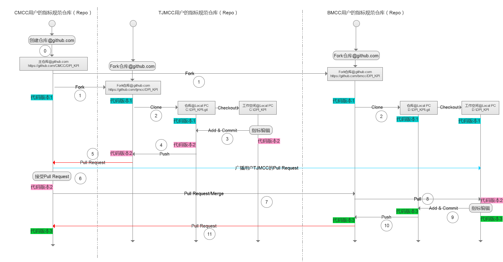

# 基于Github的基本角色和协作流程

在基于Github的版本协作工作流程中主要基于Github的*Pull Request*操作在各角色和用户见进行协同指标规范开发和维护。

## 基本角色
基本场景中设置以下三类Github用户角色和两种工作组成员类型
### Github基本用户角色
1. 主仓库创建用户
    * 主仓库的所有者，具备全部权限
    * 可以设置仓库共同维护人员
    * 可以审批并处置第三方参与用户发起的Pull Request请求
2. 主仓库共同维护用户
    * 可以直接向主仓库提交代码
3. 第三方参与用户
    * 基于Fork、Pull和Pull Request的方式参与主仓库的版本修订
    * 可以关注主仓库中发生的任何事件，并参与问题讨论
    * 向主仓库提出版本问题或建议
### 工作组成员类型及职责
1. 集团/研究院指标维护人员
    * 负责建立指标仓库
    * 可以设置仓库共同维护人员
    * 负责审批并处置第三方参与用户发起的Pull Request请求
2. 省公司指标组成员/第三方人员
    * 可以直接向主仓库提交指标规范修改代码
    * 向主仓库提出版本问题或建议
    * 关注主仓库中发生的任何事件，并参与问题讨论
    
## 基本工作流

**在本用例中假定有3位用户** 

* 用户CMCC

    集团指标工作组负责人，指标库创建及维护者

* 用户TJMCC

    A省内指标工作组成员，参与指标修订
    
* 用户BMCC

    B省内指标工作组成员，参与指标修订
    
**基本工作流程** 
 

0. 用户CMCC在Github上创建主DPI_KPI指标仓库 *(http://github.com/CMCC/dpi_kpi)* ，仓库内规范的初始版本为`状态1`。
1. 用户TJMCC、BMCC在Github上`fork`用户CMCC的DPI_KPI指标仓库到自己的Github账户下 *(http://github.com/TJMCC/dpi_kpi)*，仓库内规范的初始版本为`状态1`。
2. 用户TJMCC、BMCC将自己Github下的DPI_KPI指标仓库 *(http://github.com/TJMCC/dpi_kpi)* 克隆`clone`到本地PC机上，建立本地工作空间 *(本机上的一个目录)* 和本地仓库 *（本地工作空间下的.git目录）*，仓库内规范的初始版本为状态`1`。
3. 用户TJMCC在自己的**本地工作空间**中进行指标规范修改，完成后提交(`commit`)到自己的**本地仓库中** *（本地工作空间下的.git目录）*，仓库内规范的版本为`状态2`。
4. 在完成本地仓库提交后，用户TJMCC进一步将本地仓库中的指标规范推送(`push`)到Github网站中自己的DPI_KPI指标仓库 *(http://github.com/TJMCC/dpi_kpi)* 中，仓库内规范的版本同步到状态`2`。
5. 用户TJMCC将代码推送(`push`)到Github上自己的仓库中后，向CMCC用户的DPI_KPI仓库 *(http://github.com/CMCC/dpi_kpi)* 发起`Pull Request`请求，请求CMCC用户采纳自己对指标的修改，将修改后的指标合并到主仓库  *(http://github.com/CMCC/dpi_kpi)* 中。
6. 用户CMCC接收到`Pull Request`请求后，对代码评审，确认无误后`Merge`到主仓库 *(http://github.com/CMCC/dpi_kpi)* 中，此时主仓库内规范的版本也同步到`状态2`。
7. 此时，用户BMCC的Github上的仓库 *(http://github.com/BMCC/dpi_kpi)* 及本地仓库中的指标规范版本仍为`状态1`,为了与CMCC的主DPI_KPI指标仓库中的指标规范保持一致，用户BMCC对自己发起`Pull Request`，合并主仓库 *http://github.com/CMCC/dpi_kpi* 的规范变动。合并成功后，用户B的Github仓库内规范的版本也同步到状态`2`。
8. 用户BMCC在Github上`Pull Request` & `Merge`成功后，在本地PC上的本地仓库及工作空间中拉取(`pull`)最新的指标规范(同步到`状态2`)，然后进一步在本地工作空间内做本地编辑，此时用户B的本地工作空间内的规范的版本已到状态`3`。
9. 用户BMCC本地编辑结束后，向本地仓库提交`commit`修改结果，仓库内规范的版本为`状态3`。
10. 用户BMCC进一步向自己的Github上的仓库 *(http://github.com/BMCC/dpi_kpi)* 提交修改结果，仓库内规范的版本为`状态3`。
11. 此后，BMCC用户向CMCC用户的DPI_KPI仓库 *(http://github.com/CMCC/dpi_kpi)* 发起`Pull Request`请求，请求CMCC用户采纳自己对指标的修改，将修改后的指标合并到主仓库。
12. 用户CMCC审核通过后，将BMCC用户提交的规范修订结果合并到主仓库中，至此主仓库中的指标规范版本同步到`状态3`...

## Github & Git工原理及介绍
    关于基于Git及Github的文章进行协作开发的文章很多，按照难易度，建议按照如下顺序进行阅读
- [Git与Repo入门](http://www.cnblogs.com/angeldevil/archive/2013/11/26/3238470.html)  -- 阅读关于版本控制历史的相关介绍即可
- [git概念 原理 使用](http://blog.csdn.net/chenj_freedom/article/details/50543152) -- 阅读Git工作原理和基本概念
- [Understanding the GitHub Flow](https://guides.github.com/introduction/flow/)  -- GitHub官方工作流简介文档
- [使用Git和Github进行协同开发流程](https://segmentfault.com/a/1190000002413519)  -- 基于Github的协作工作流程，对本文是一个更为详尽的说明
- [Pro Git book](https://git-scm.com/book/zh/v2)    -- 全面学习Git相关知识