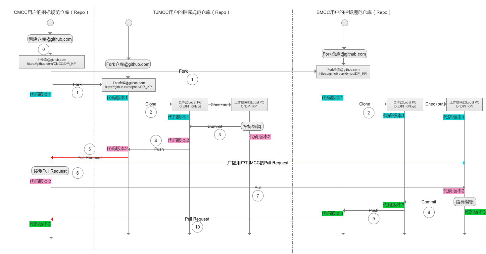

# 基于Github的基本协作流程

在基于Github的版本协作工作流程中主要基于Github的*Pull Request*操作在各角色和用户见进行协同指标规范开发和维护。

## 基本角色
基本场景中设置以下三类Github用户角色和两种工作组成员类型
### Github基本用户角色
1. 主仓库创建用户
    * 主仓库的所有者，具备全部权限
    * 可以设置仓库共同维护人员
    * 可以审批并处置第三方参与用户发起的Pull Request请求
2. 主仓库共同维护用户
    * 可以直接向主仓库提交代码
3. 第三方参与用户
    * 基于Fork、Pull和Pull Request的方式参与主仓库的版本修订
    * 可以关注主仓库中发生的任何事件，并参与问题讨论
    * 向主仓库提出版本问题或建议
### 工作组成员类型及职责
1. 集团/研究院指标维护人员
    * 负责建立指标仓库
    * 可以设置仓库共同维护人员
    * 负责审批并处置第三方参与用户发起的Pull Request请求
2. 省公司指标组成员/第三方人员
    * 可以直接向主仓库提交指标规范修改代码
    * 向主仓库提出版本问题或建议
    * 关注主仓库中发生的任何事件，并参与问题讨论
    
## 基本工作流

