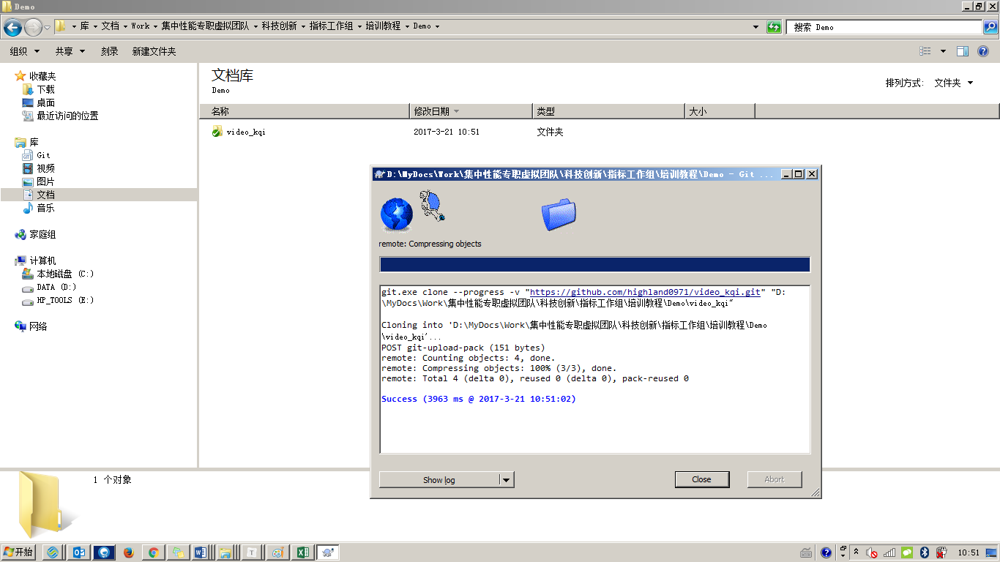

# 规范修订过程的示例-视频流畅度指标

## 场景设置

集团公司2016年视频流畅度指标研究试点，牵头下发试点指标规范，各省公司参与。

* 总部项目负责人：假定账户highland0971 ，负责发起项目，建立指标规范主仓库
* A省公司项目参与人：假定账户joyhighland，负责参与指标规范修订
* B省公司项目参与人：假定账户15802221580，负责参与指标规范修订

## 1. 建立集团主仓库（总部项目负责人highland0971@github.com）

## 2. 建立本地仓库（总部项目负责人highland0971@github.com）

	前置条件：安装Git及GitTortoise工具，安装Typora文档开发工具

## 3. 建立初始指标规范（总部项目负责人highland0971@github.com）

	前置条件：安装Typora文档开发工具

## 4. 关注集团仓库，并Clone到本地仓库（A、B省项目人员joyhighland、15802221580）

	前置条件：安装Git及GitTortoise工具，安装Typora文档开发工具

## 5. A省用户修改规范，并提交集团主仓库合并（账号joyhighland）

## 6. 获得Pull Request通知

## 7. 评审并合并Pull Request请求

### 7.1 第三方参与者评审 （B省项目人员15802221580）

### 7.2 主仓库维护人员评审处置（总部项目负责人highland0971@github.com）

## 8. B省用户同步最新规范(账号15802221580)

