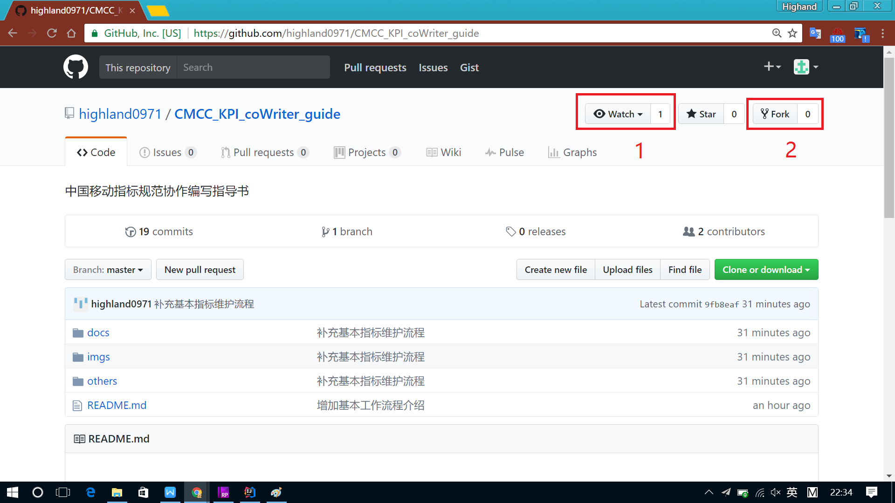
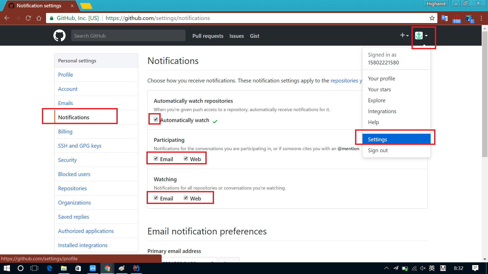
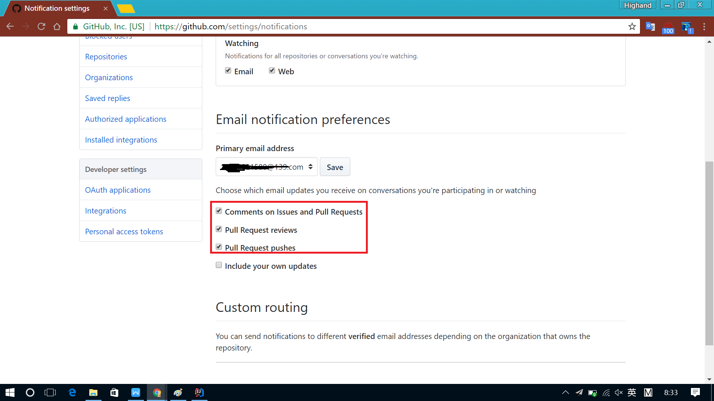
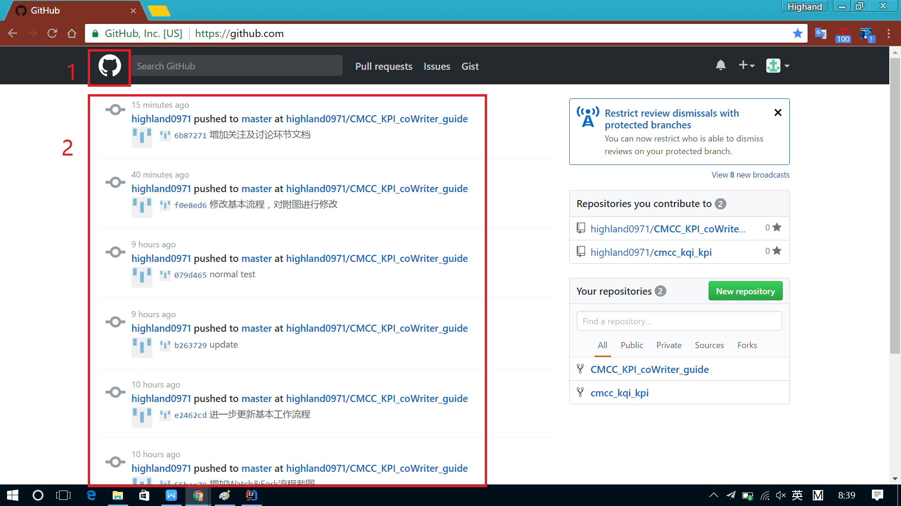
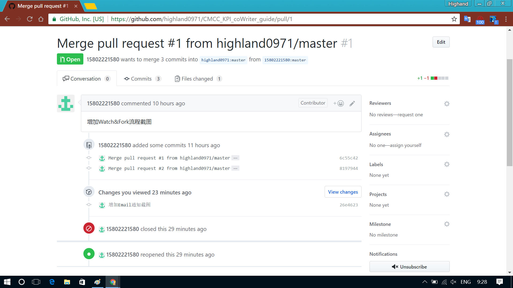
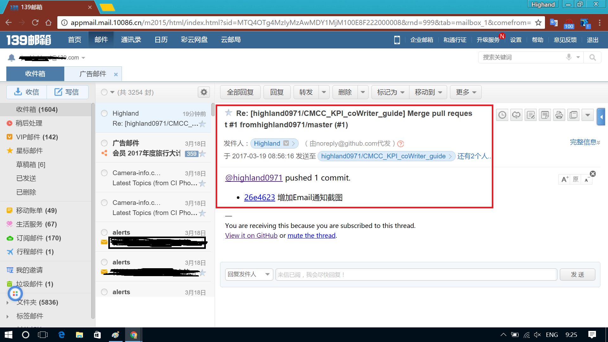
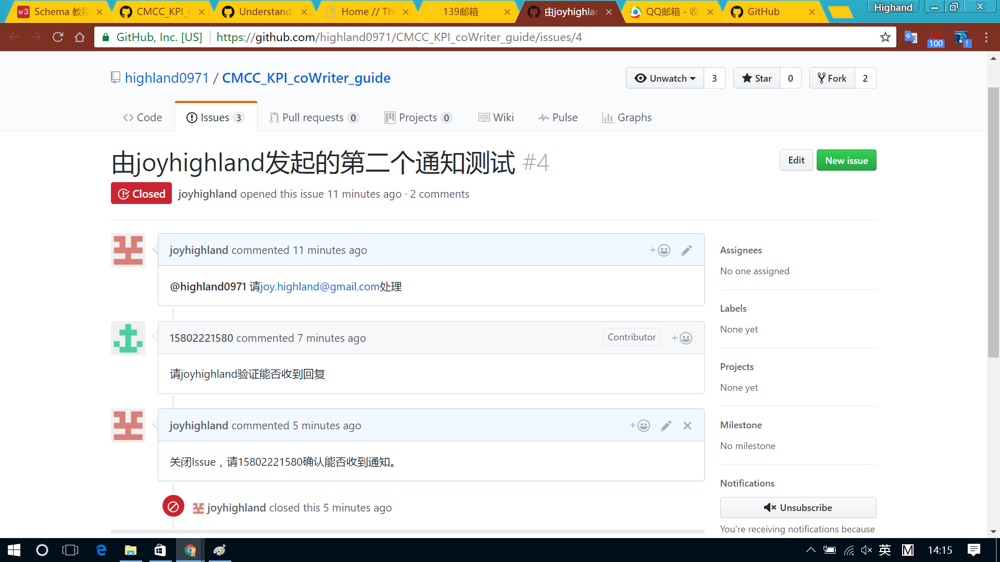
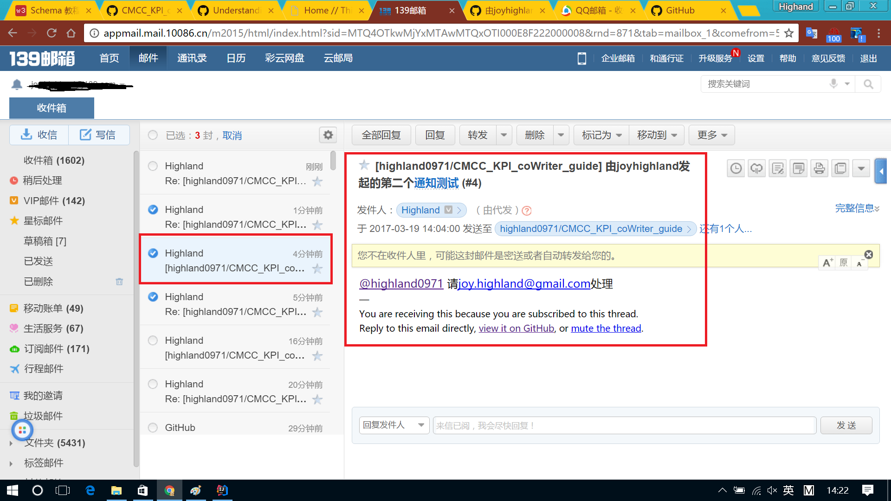
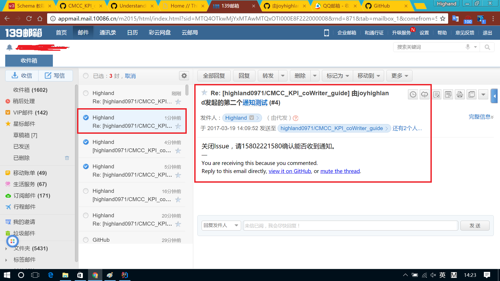
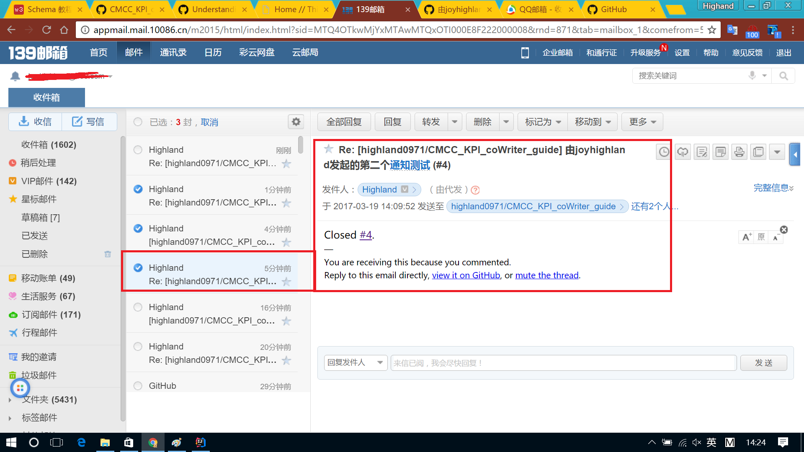

# 关注并参与讨论

在基于**Github**的项目协作中，任何一个参与方都可以全程参与到协作内容的审阅及问题讨论环节。通过在Github中关注所参与的项目(任一指标规范修订项目)，便可追踪项目中所发生的一切环节：
* 版本更新、发布
* 问题讨论
* 代码合并请求

下面简单对该过程进行介绍

---
1. **选择所关心的项目创建副本(`Fork`)并关注(`Watch`)**

2. **设置关注内容及通知方式**

3. **查看所关注项目的更新(@Github)**

4. **查看所关注项目的更新(@Email)**

* 15802221580 从Fork的子项目中发起Pull Request请求给主仓库@highland0971 *
  

* 由于15802221580账户关注了主仓库@highland0971，主仓库@highland0971收到Pull Request会被推送到15802221580账户的注册邮箱中 *
  

5. **参与所关注项目的讨论(@Email)**
   新增一个joyhighland用户关注了 highland0971的[中国移动指标规范协作编写指导书](https://github.com/highland0971/CMCC_KPI_coWriter_guide)项目。关注后，并在该项目的主仓库中提交了一个问题 *(Issue)*: 
     > [由joyhighland发起的第二个通知测试 #4](https://github.com/highland0971/CMCC_KPI_coWriter_guide/issues/4)
     > 

此后，15802221580用户在他的邮箱中便收到了joyhighland用户提交的问题通知及后续其它人的回复处理进展：

