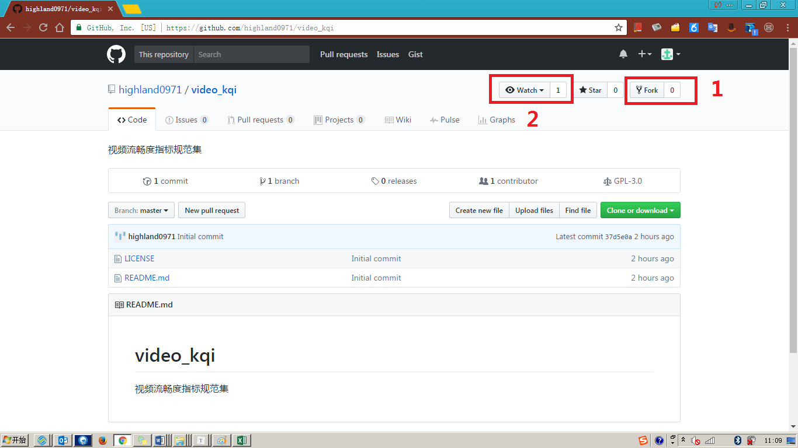
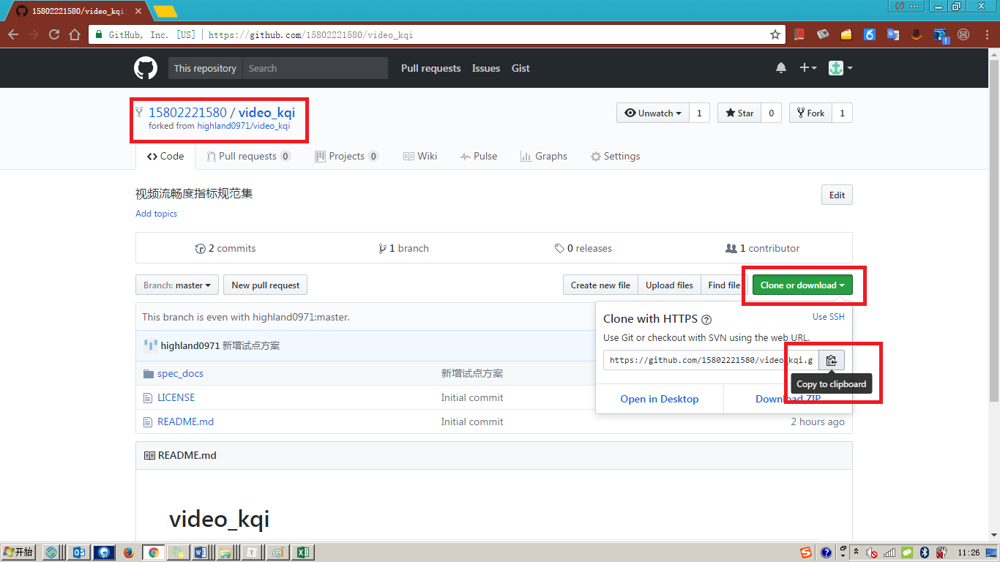

# 关注并参与讨论

在基于**Github**的项目协作中，任何一个参与方都可以全程参与到协作内容的审阅及问题讨论环节。通过在Github中关注所参与的项目(任一指标规范修订项目)，便可看到项目中所发生的一切环节：
* 版本更新、发布
* 问题讨论
* 代码合并请求

下面简单对该过程进行介绍

---
1. **选择所关心的项目创建副本(`Fork`)并关注(`Watch`)**

2. **设置关注内容及通知方式**

3. **查看所关注项目的更新(@Github)**

4. **查看所关注项目的更新(@Email)**

