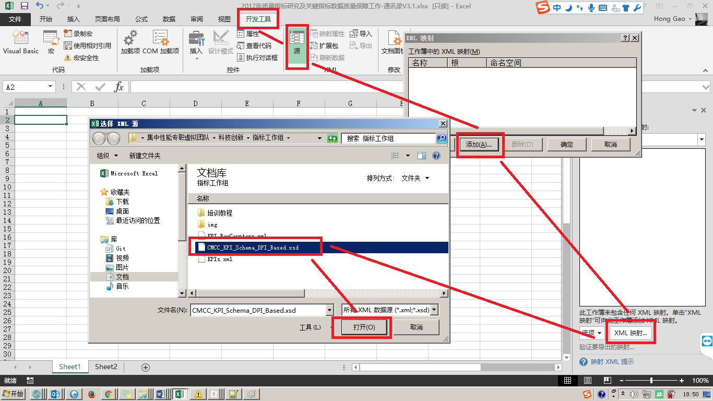
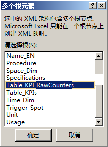
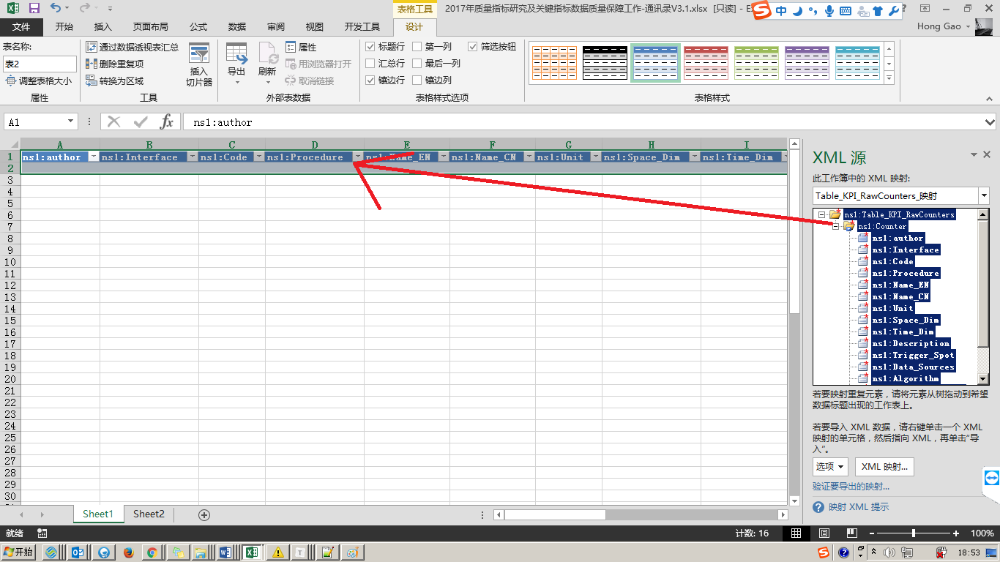
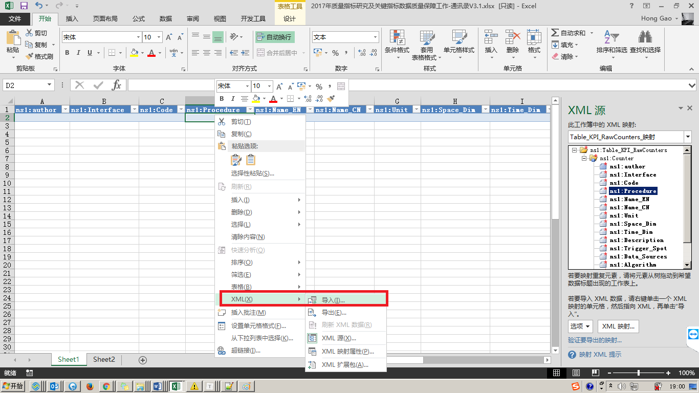
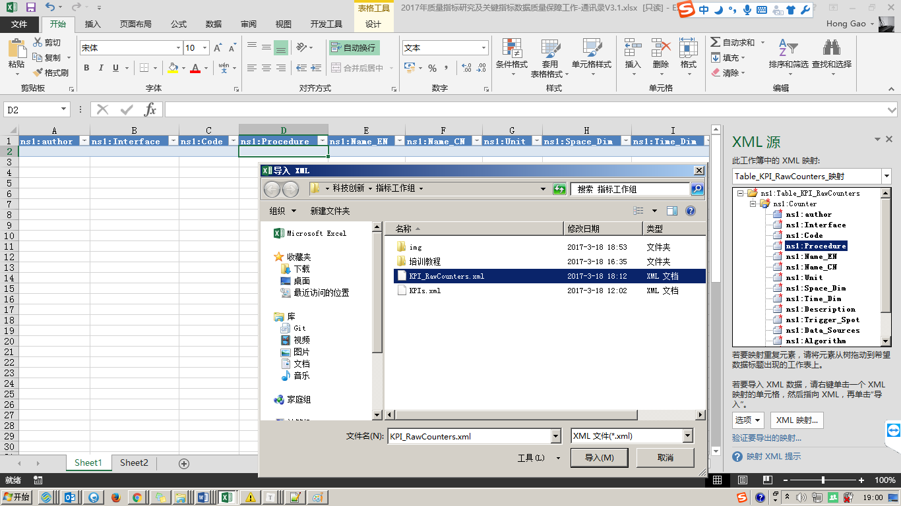
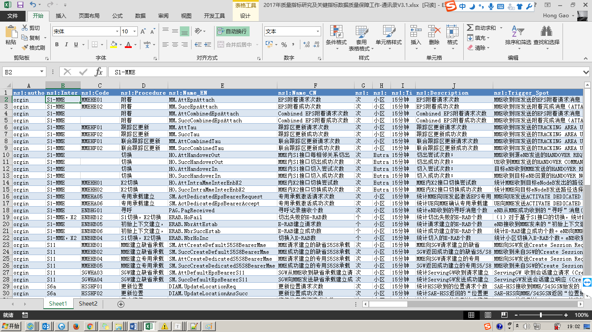
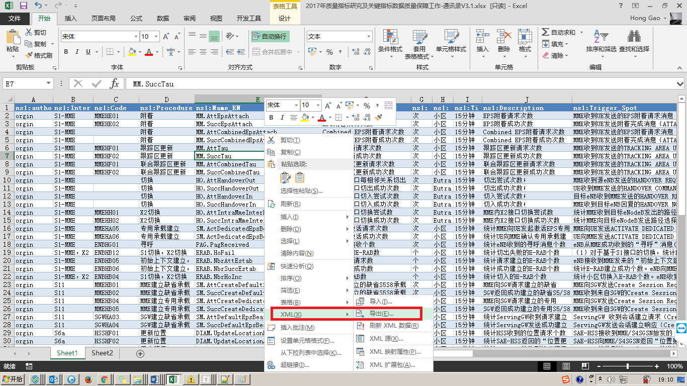
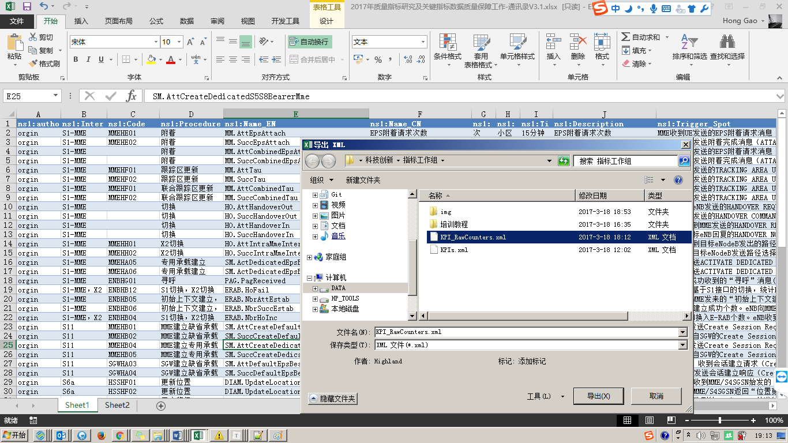

# 基于XML/XSD的表格规范编写

​	为实现基于Github等版本管理系统的的指标规范修订内容的可追踪和审查，在新版指标规范修订时，需要将原由Excel编写的指标规范表（Office系列原生文件均为二进制文件，无法使用外部工具对其内部文字进行版本审查和比较）调整为由纯文本文档格式编写的指标规范，同时需要兼顾排版要求。为达到该要求，目前可考虑使用基于XML/XSD标记规范进行指标规范文档编写。

​	使用XML标记语言及基于XSD的XML文档格式约束，可以实现在Excel软件中将数据内容和表单格式约束拆分保存，在提交Github等版本库审查时，可仅对表格内数据内容变化进行审查。以**《LTE信令监测及互联网KQI指标规范v2.0(第二册 基于单接口的测量项及指标定义)》** 为例，分别将原Excel表拆分为以下两部分：

## XML数据文档

*（表格实际数据内容部分，变化较为频繁，也是指标规范审计的主要内容）*

```
<?xml version="1.0" encoding="UTF-8" standalone="yes"?>
<ns1:Table_KPI_RawCounters xmlns:ns1="http://www.chinamobile.com/spec">
	<ns1:Counter ns1:author="orgin">
		<ns1:Interface>S1-MME</ns1:Interface>
		<ns1:Code>MMEHE01</ns1:Code>
		<ns1:Procedure>附着</ns1:Procedure>
		<ns1:Name_EN>MM.AttEpsAttach</ns1:Name_EN>
		<ns1:Name_CN>EPS附着请求次数</ns1:Name_CN>
		<ns1:Unit>次</ns1:Unit>
		<ns1:Space_Dim>小区</ns1:Space_Dim>
		<ns1:Time_Dim>15分钟</ns1:Time_Dim>
		<ns1:Description>EPS附着请求次数</ns1:Description>
		<ns1:Trigger_Spot>MME收到UE发送的EPS附着请求消息（ATTACH REQUEST，3GPP TS 24.301），不计重发。</ns1:Trigger_Spot>
		<ns1:Data_Sources>S1-MME接口XDR</ns1:Data_Sources>
		<ns1:Algorithm>统计一定的时间粒度及网元粒度下，Procedure Type为1的S1-MME接口XDR的个数</ns1:Algorithm>
		<ns1:Specifications>中国移动统一DPI设备技术规范-LTE信令采集解析服务器接口规范v2.0.9.docx
中国移动北向接口规范测量项MME-PM(V2.0.2).xlsx</ns1:Specifications>
		<ns1:Comments/>
		<ns1:Modify_Reason/>
	</ns1:Counter>
	<ns1:Counter ns1:author="orgin">
		<ns1:Interface>S1-MME</ns1:Interface>
		<ns1:Code>MMEHE02</ns1:Code>
		<ns1:Procedure>附着</ns1:Procedure>
		<ns1:Name_EN>MM.SuccEpsAttach</ns1:Name_EN>
		<ns1:Name_CN>EPS附着成功次数</ns1:Name_CN>
		<ns1:Unit>次</ns1:Unit>
		<ns1:Space_Dim>小区</ns1:Space_Dim>
		<ns1:Time_Dim>15分钟</ns1:Time_Dim>
		<ns1:Description>EPS附着成功次数</ns1:Description>
		<ns1:Trigger_Spot>MME收到UE发送附着完成消息（ATTACH COMPLETE，3GPP TS 24.301），不计重发。</ns1:Trigger_Spot>
		<ns1:Data_Sources>S1-MME接口XDR</ns1:Data_Sources>
		<ns1:Algorithm>统计一定的时间粒度及网元粒度下，Procedure Type为1且Procedure Status为0的S1-MME接口XDR的个数</ns1:Algorithm>
		<ns1:Specifications>中国移动统一DPI设备技术规范-LTE信令采集解析服务器接口规范v2.0.9.docx
中国移动北向接口规范测量项MME-PM(V2.0.2).xlsx</ns1:Specifications>
		<ns1:Comments/>
		<ns1:Modify_Reason/>
	</ns1:Counter>
	...有省略...
	...有省略...
</ns1:Table_KPI_RawCounters>
```

##  XSD约束文档

*（负责对XML文档的规范性进行检查和约束，变化较少，仅当Excel表结构发生调整时才会有变化。）*

```
<?xml version="1.0" encoding="UTF-8" ?>
<xs:schema xmlns:xs="http://www.w3.org/2001/XMLSchema"
targetNamespace="http://www.chinamobile.com/spec"
xmlns="http://www.chinamobile.com/spec"
elementFormDefault="qualified">

  <!-- 基本元素的定义 -->
  <xs:element name="Interface">
      <xs:simpleType>
          <xs:restriction base="xs:string">
              <xs:enumeration value="S1-MME"/>
              <xs:enumeration value="S1-U"/>
              <xs:enumeration value="S6a"/>
              <xs:enumeration value="S11"/>
              <xs:enumeration value="Rx"/>
              <xs:enumeration value="S1-MME/X2"/>
          </xs:restriction>
      </xs:simpleType>
  </xs:element>
  <xs:element name="Code" type="xs:string"/>
  <xs:element name="Procedure" type="xs:string"/>
  <xs:element name="Name_EN" type="xs:string"/>
  <xs:element name="Name_CN" type="xs:string"/>
  <xs:element name="Unit">
      <xs:simpleType>
          <xs:restriction base="xs:string">
              <xs:enumeration value="次"/>
              <xs:enumeration value="个"/>
              <xs:enumeration value="ms"/>
          </xs:restriction>
      </xs:simpleType>
  </xs:element>
  <xs:element name="Space_Dim" type="xs:string"/>
  <xs:element name="Time_Dim" type="xs:string"/>
  <xs:element name="Description" type="xs:string"/>
  <xs:element name="Trigger_Spot" type="xs:string"/>
  <xs:element name="Data_Sources" type="xs:string"/>
  <xs:element name="Algorithm" type="xs:string"/>
  <xs:element name="Specifications" type="xs:string"/>
  <xs:element name="Comments" type="xs:string"/>
  <xs:element name="Usage" type="xs:string"/>
  <xs:element name="Modify_Reason" type="xs:string"/>

  <!-- 属性的定义 -->
  <xs:attribute name="author" type="xs:string"/>

  <!-- 指标表格定义（复合元素） -->
  <xs:element name="Table_KPI_RawCounters">
      <xs:complexType>
          <xs:sequence>
              <xs:element name="Counter" maxOccurs="unbounded">
                  <xs:complexType>
                      <xs:sequence>
                          <xs:element ref="Interface" />
                          <xs:element ref="Code"/>
                          <xs:element ref="Procedure"/>
                          <xs:element ref="Name_EN"/>
                          <xs:element ref="Name_CN"/>
                          <xs:element ref="Unit"/>
                          <xs:element ref="Space_Dim"/>
                          <xs:element ref="Time_Dim"/>
                          <xs:element ref="Description"/>
                          <xs:element ref="Trigger_Spot"/>
                          <xs:element ref="Data_Sources"/>
                          <xs:element ref="Algorithm"/>
                          <xs:element ref="Specifications" />
                          <xs:element ref="Comments"/>
                          <xs:element ref="Modify_Reason"/>
                      </xs:sequence>
                      <xs:attribute ref="author" use="required"/>
                  </xs:complexType>
              </xs:element>
          </xs:sequence>
      </xs:complexType>
  </xs:element>
  ...有省略...
  ...有省略...
</xs:schema>
```


## 利用Excel对XML数据进行编辑

1. 导入XSD约束文档

   * 在Excel中加载`.XSD`文件

   

   * 选择要映射的表格（复杂元素）

   

   * 将映射表格拖拽至Excel中的具体Sheet中

   

2. 导入XML指标规范数据

   * 在XSD映射的Sheet单元格中右键点击`XML-`>`导入`

   

   * 选择加载遵循XSD规范约束的XML数据文件

   

   


      ** 此后就可以按照正常表格操作的方式对指标规范进行编辑了！**

3. 导出XML指标规范数据

   * 对规范内容编辑结束后，右键点击表格选择`XML`->`导出`，覆盖原有指标规范XML文件。

     

     


## 关于XML及XSD规范的参考资料

[如何在Excel中加载XML文件](https://support.office.com/zh-cn/article/%E5%B0%86-XML-%E5%85%83%E7%B4%A0%E6%98%A0%E5%B0%84%E5%88%B0-XML-%E6%98%A0%E5%B0%84%E4%B8%AD%E7%9A%84%E5%8D%95%E5%85%83%E6%A0%BC-ddb23edf-f5c5-4fbf-b736-b3bf977a0c53)

[XML Schema (XSD) 教程 ](http://www.w3school.com.cn/schema/index.asp)

[XML  教程 ](http://www.w3school.com.cn/xml/index.asp)