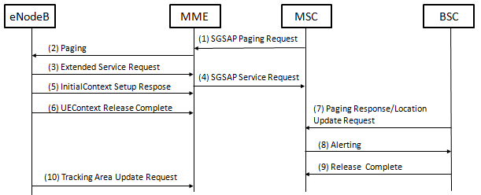

# 中国移动通信技术标准

##LTE信令监测及互联网KQI指标规范


### 1. 范围

​	本规范定义了LTE网络基于信令采集及用户数据采集的指标定义，涉及“Uu、X2、S1-MME、S1-U、S11、S6a、SGs、Gn-C、Gm、Mw、Mg、ISC、Sv、Cx、Dx、Sh、Dh、Rx、Gx”接口，供中国移动内部使用；适用于网络质量评估及网络优化等工作。

### 2.  规范性引用文件

​	下列文件中的条款通过本标准的引用而成为本标准的条款。凡是注日期的引用文件，其随后所有的修改单（不包括勘误的内容）或修订版均不适用于本指标体系，然而，鼓励根据本指标体系达成协议的各方研究是否可使用这些文件的最新版本。凡是不注日期的引用文件，其最新版本适用于本标准。

| **序号** | **标准名称**                         | 发布单位       |
| ------ | -------------------------------- | ---------- |
| [1]    | 中国移动统一DPI设备技术规范-LTE数据合成服务器接口规范   | 中国移动通信集团公司 |
| [2]    | 中国移动统一DPI设备技术规范-LTE信令采集解析服务器接口规范 | 中国移动通信集团公司 |
| [3]    | 中国移动统一DPI设备技术规范                  | 中国移动通信集团公司 |

### 3. 术语、定义和缩略语

下列术语、定义和缩略语适用于本指标体系：

| **缩略语** | **英文全称**                         | **中文含义**  |
| ------- | -------------------------------- | --------- |
| AGCF    | Access  Gateway Control Function | TDM中继接入网关 |
| AS      | Application  Server              | 应用服务器     |
| CSCF    | Call  Session Control Function   | 呼叫会话控制功能  |

### 4. 概述
​	本规范遵循中国移动统一DPI架构，并基于统一DPI的xDR生成各项指标。
#### 4.1. 关于指标分类的说明
​	规范定义了两类指标：

- 第一类：基于信令面数据的指标（简称“信令监测指标”），该指标主要用于网络质量评估。信令监测指标采集的接口较多，基于单个接口信令数据的指标，在信令点定义上可尽量与基于网元统计（计数器）的指标定义保持一致，所以本规范将这一类指标单独成册。

- 第二类：基于用户面数据的指标（简称“KQI指标”），该指标主要面向特定用户或特定业务的质量评估，可以在一定程度上间接评估用户的实际感知。
#### 4.2. 关于指标分类的说明
​	本文档所描述的指标，除特别规定外，从最小空间粒度向上一级空间粒度汇聚的算法和从最小时间粒度向上一级汇聚的算法，都遵循“算法的分子分母各自累加”的原则。个别指标在向上一级汇聚时有特殊要求的，在此指标描述中会单独说明

​	例如:

```
VoLTE语音始呼接通率 = VoLTE语音始呼接通次数/VoLTE语音始呼总次数
```

​	空间粒度为UE，当向上汇聚至SBC设备粒度时，指标的实际计算方式为：

```
VoLTE语音始呼接通率 = (UE1：VoLTE语音始呼接通次数+UE1：VoLTE语音始呼接通次数+⋯+UEn：VoLTE语音始呼接通次数)/(UE1：VoLTE语音始呼总次数+UE2：VoLTE语音始呼总次数+⋯+Un：VoLTE语音始呼总次数)
```

### 5. LTE信令监测指标

#### 5.1. 基于单接口信令指标

​	请参见“LTE信令监测及互联网KQI指标规范(第二册 基于单接口的测量项及指标定义)”。

#### 5.2. CSFB分析指标

##### 5.2.1 CSFB被叫试呼次数

1. 指标名称：CSFB被叫试呼次数
2. 英文名称：Service.CSFB.MtcEsrMsgCount
3. 业务需求：统计CSFB被叫试呼次数。
4. 指标定义：统计时间段内，S1接口上被叫原因UE上报Extended Service request消息次数。（参考3GPP 24.301）
5. 指标算法：统计时间段内，累加Extended Service request消息次数（下图消息3），其中Service type=Mobile terminating CS fallback or 1xCSfallback（1）。
   
6. 测量数据映射关系：S1-MME XDR，其中字段“Procedure Type”=3且“Keyword”=1的XDR个数。
7. 数据类型: 整型
8. 数据单位：次
9. 空间粒度：终端/小区/TAC/MME
10. 时间粒度：15分钟
11. 数据来源：S1-MME/S6a

---
